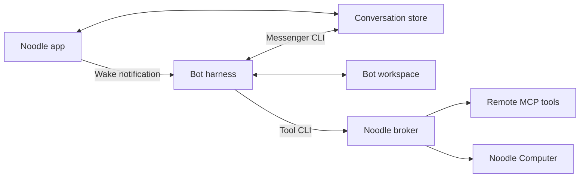

# Architecture

Noodle coordinates work with individual agents and groups. It stores conversations
locally and runs one harness process per bot, sharing that bot's session across
direct and group work.

## Message flow

1. The app saves a message and its attachments.
2. It notifies each bot in the conversation. The wake contains no message body.
3. Each bot reads its inbox through Messenger and replies through the same CLI.
4. Noodle observes the stored reply and updates the chat and notifications.

Messenger advances each bot's read positions and excludes its own messages.
Conversation writes use filesystem locks and atomic replacement so several bots
can reply safely. See [storage](storage-and-messenger.md).

## Harnesses and recovery

Drivers share a `start`, `stop`, and `notify` interface:

| Harness | Transport |
| --- | --- |
| Codex | App Server |
| Claude Code | stream-json |
| FX, Grok Build, OpenCode v2 | ACP |
| Muse Code | MSP |
| Apple Intelligence | ACP through the bundled `NoodleAppleAgent` helper |

Noodle starts configured bots when it opens and stops them when it quits. Closing
a window leaves them running. Notifications coalesce while a bot is busy.
Unexpected exits trigger bounded retries; terminal failures can require manual retry.

Session IDs and unfinished-work markers survive restarts. Recovery tells the bot
to check its inbox and continue interrupted work. External actions may already have
completed, so the bot must verify before repeating them. Heartbeats use the same
wake path for authorized follow-ups during idle time.

## Workspaces and access

Each bot has a UUID-named package containing `agent.json`, Noodle-owned `runtime`
state, and a writable `workspace` subdirectory. The private `backstory` field in
`agent.json` is the source of truth; it is omitted from the public `AgentRecord`
used by profiles and participant lists. Edit Backstory through Noodle. `AGENTS.md`
renders that backstory and runtime guidance; `CLAUDE.md` points to the same file.
The whole file is generated, without managed-section markers. Noodle can replace
edited, missing, or corrupted output without parsing it or changing Backstory.
Custom skills are preserved. Keep standing preferences in `preferences.md` and durable facts,
decisions, and ongoing context in `memory.md`. Noodle creates `preferences.md` when
missing, including in existing workspaces, and never overwrites its contents.
Agents are instructed to read it at session start and after changes; newer explicit
user requests take precedence. Apple loads a bounded preference excerpt alongside
the backstory for every wake, including chat turns without workspace tools.

Backstory lives in `agent.json`. Noodle never recovers it from generated Markdown.

The signed Agent Host applies a dedicated filesystem sandbox before starting
restricted Codex, FX, Grok Build, Muse Code, OpenCode, or Apple. Each can read only its own
bot package alongside required system/application files, and write its workspace;
parent configuration and runtime state stay read-only. Folders shared in Edit Bot
are read from the bot's `agent.json` by Agent Host and added to that profile. Cloud harness homes and
session stores are private to the bot, seeded only with provider login material.
Messenger uses an app-side broker bound to the registered bot workspace and token.
The broker checks conversation membership and copies attachments into the caller's
workspace, keeping raw conversation files and other bots' packages inaccessible.
Unrestricted harnesses use a separate authorized launch path. The app remains in
App Sandbox and brokers remote tools and Computer
requests after checking assignments. See [agent access](security.md),
[MCP connections](mcp-connections.md), and the [Computer bridge](../Computer/Bridge/README.md).

## Sandbox and launch boundary

[Agent access and privacy](security.md) is the user guide. This section covers
how the boundary is built.

### Launch boundary

Noodle uses two separate macOS boundaries. The app stays in App Sandbox. A signed
launch broker, `NoodleAgentHost.xpc`, runs outside that app sandbox as the current
user, never root. It validates the calling app, the vendor-signed harness
executable, the bot workspace, and a fixed set of launch options. For restricted
runs it applies a deny-by-default Seatbelt policy before executing the harness.
The policy permits fixed paths and system services derived by the host; it
accepts no caller-supplied sandbox profile, arbitrary command, or writable roots.
If validation or policy application fails, startup fails instead of falling back
to unrestricted access. Unrestricted harnesses use the separate authorized launch
path. App and helper entitlements are unchanged by bot isolation, and enabling
another restricted harness does not require broader app entitlements.

Shell commands and other child processes inherit the harness's OS restrictions.
An automatically accepted tool approval cannot add filesystem permissions to
that policy. All harnesses use the bot's saved access preference; editing
`agent.json` alone never grants unrestricted access. A grant is saved only once
the previous runtime has stopped; a revocation is saved before shutdown.

### Restricted policy

Each restricted bot can read its own `Agents/<uuid>` package and write only
inside that package's `workspace`. Its `agent.json`, layout metadata, and
Noodle-owned `runtime` remain read-only. Other bots' packages, the shared
conversation store, Noodle preferences, and unrelated personal files are outside
the content-read and write boundary. System libraries, the signed app/harness
installation, and required system services remain available.

The profiles generally allow metadata queries, so file existence and attributes
can be visible even when contents cannot be read. FX also needs exact
directory-entry reads along its workspace ancestors for native skill discovery;
these can expose sibling names, but not sibling contents. Cloud profiles allow
outbound networking, including the LAN and localhost, and deny listening
sockets. Restricted cloud and Apple profiles do not reliably prevent reading
another same-user process's command arguments on macOS 27.

Shared folders are stored in the bot's `agent.json`, which the bot cannot write.
Agent Host reads the list at launch, not from the app's request, and refuses the
whole disk, any folder that contains or lies inside Noodle's own storage, and
links that resolve there. A folder nested inside another read-and-write shared
folder is covered by that folder and never resolved on its own, and a missing
folder is skipped. Saving restarts the bot, because a running sandbox cannot be
widened. Shared folders and descriptions are listed in the generated `AGENTS.md`.

Workspace mailboxes, attachment copies, and managed instructions/skills use
anchored directory handles. Replacing a writable parent directory with a symlink
cannot redirect a privileged app operation into another bot's files.

### Conversation broker

Conversation access goes through the Messenger CLI and an app-side broker. The
broker derives bot identity from the registered workspace and a per-bot session
token, then checks conversation membership. A CLI flag, forged bot ID, or edited
skill cannot grant another bot's access. The CLI has no direct conversation-file
fallback. Attachment reads return copies under
`workspace/.noodle/messenger-attachments`; local attachment sends can import only
regular files from the caller's workspace, without following symlinks.

### Harness storage and sign-in

Cloud harnesses have a private home at `workspace/.noodle/home`. Codex, Claude, FX,
Grok, Muse, and OpenCode store their own configuration, sessions, and caches
there; Muse's data, state, and runtime directories remain under
`workspace/.noodle/muse`. Agent Host seeds only login material from the existing
provider sign-in. It does not copy standalone conversations, global skills,
hooks, or MCP configuration. FX also receives its selected provider/model
settings. Native installations stay read-only.

A bot's selected [profile](harness-setup.md#profiles) is a private field in its
`agent.json`. The app never sends a path, environment, or command: Agent Host
reads the field at launch, resolves it to `HarnessProfiles/<uuid>/home` in
Noodle's storage, and refuses a profile that is missing, redirected through a
link, or made for another harness. Profile sign-in and status checks name the
profile by identifier only; the host derives the harness, the folder, and the
fixed login command from it, and forwards only a device code whose page is the
vendor's own sign-in address. A profile's login is its files alone: the host
never reads a Keychain item on a profile's behalf. A restricted bot's sandbox
cannot read the profiles folder, and shared folders cannot overlap it.

For Claude, FX, and Muse Keychain-backed sign-ins, the host requests only the
exact provider credential item, without prompting. The harness receives a private
file credential store and has no access to the login Keychain or shared account
folder. If macOS denies that item, startup fails with a Keychain-access error.
FX's TLS implementation still reads the system certificate store at
`/Library/Keychains/System.keychain`.

Each bot keeps credentials it refreshes. The host replaces them when the source
login changes, and never writes the bot's credentials back to the shared login.

### Harness notes

FX uses ACP ask mode and Noodle grants only the offered allow-once action for the
current session. Grok uses a dedicated `--no-leader` process with its inner
sandbox disabled because Agent Host has already applied the mandatory outer
policy. Cancelled turns and stale-session requests are denied.

OpenCode v2 uses a private ACP process and its own authenticated loopback server.
The listener permission applies only to the verified OpenCode executable; shell
tools cannot listen on network ports. The native v2 server binds `127.0.0.1`.
Seatbelt cannot enforce the IP address for incoming connections, so this binding
relies on the verified native implementation. Server descendants inherit the same
workspace restrictions. ACP permissions accept only the offered allow-once choice
for the current session. Client filesystem and terminal services, automatic
updates, and filesystem watchers are disabled. Project discovery outside the
workspace is disabled; the bot's managed `AGENTS.md` and skills are linked into
its private OpenCode configuration. Optional provider settings come only from its
private config and the workspace's `opencode.json`.

The host reads only saved API-key and OAuth credential rows from OpenCode's
standard v2 database. It never copies that database or its conversations.
Database creation and credential writes run under the bot's restricted OS policy,
including during account/model inspection in a temporary workspace. Refreshed
private credentials are preserved until the source login changes, which replaces
the private credential rows without touching sessions. Unsupported credential
schemas fail closed. Global executable configuration and MCP credentials are not
imported.

Muse starts its verified native binary directly, without the self-updating shell
launcher. Agent Host applies the outer sandbox before running `serve`; Muse's
inner shell sandbox is disabled to avoid nesting Seatbelt policies. MSP tool
approvals select only the offered once-only choice for the current session and
stage.

Claude uses its normal stream-json runtime and tools. Agent Host explicitly sets
`sandbox.enabled=false` for restricted launches: Noodle's outer policy covers
native Read/Edit/Write tools, Bash, and child processes. `CLAUDE_CONFIG_DIR` points
to the bot's private `.claude` directory, and `CLAUDE_CODE_TMPDIR` keeps Claude's
internal temporary files inside the workspace. The host seeds only `claudeAiOauth`
from the standard `Claude Code-credentials` Keychain item for the current user,
or the native `.claude/.credentials.json` fallback when that item is absent.
Settings, hooks, MCP logins, and global history are not imported. Restricted and
unrestricted sessions have separate pointers; switching access does not resume the
other mode's native session.

Account apps are set at launch: Codex receives an explicit `apps` feature
override, and Claude receives `disableClaudeAiConnectors` in its launch settings.
Setup and model-discovery probes run with apps disabled.

Structured runtime question requests receive an empty response immediately.
Unknown requests and tool forms requiring user-entered data are declined.

### Tool and Applet requests

`messenger tool` saves binary results under `workspace/.noodle/tool-attachments`
without overwriting existing files. For tool connections, `@file` inputs can read
only regular workspace files, rejecting symlinks, hard links, and traversal.
Resource links require an explicit read; returned links are never followed
automatically. Noodle removes anything a tool connection sends that imitates
Noodle's own tool markers.

Applet requests are checked against the current bot session and conversation
membership before dispatch, again after companion startup waits, and before any
result is released. Removing and re-adding a bot does not reactivate requests
from its previous session. Revoked callers receive neither success payloads nor
provider diagnostics. HTML noodlets read only their package and data directory.
Native Swift noodlets compile and run under a deny-by-default profile applied by
Applet's `NoodletHost.xpc`, limited to their build, their data directory and a
private home directory.

### Installed harnesses

A harness [installed by Noodle](harness-setup.md#harnesses-installed-by-noodle) lives in
`Harnesses/<harness>/<version>` in Noodle's storage. The sandboxed app downloads
the provider's release over HTTPS from a fixed list of the provider's own hosts,
following redirects on the same host only, checks the published SHA-256 where the
provider has one, and unpacks it into a staging folder. macOS quarantines what a
sandboxed app writes, so nothing the app stages can run. The app then names the
harness, version, and staging identifier to Agent Host, never a path. The host
derives the folder, refuses entries that link outside it, verifies the same pinned
vendor signature it requires of a native installation (for Codex, its bundled
tools too), and only then lifts the quarantine and moves the release into place. A
download that fails any check is deleted. At every launch the host validates the
path again: it must be exactly a version folder of that harness, reached without
links, and correctly signed. A compromised app can therefore install only genuine
vendor-signed releases, though it could choose an older one. The App Sandbox
refuses the app execute access to everything in its own container, so only the
host can ever run a harness installed this way. That includes the two things the
app otherwise runs a Codex installation for itself: the account check and
sign-in, and the model list. For a Codex the app cannot execute, the host runs
both with its fixed environment, returns only the sign-in state or the model
catalogue, and forwards a device code only for OpenAI's own sign-in page. Grok
Build and Muse Code sign in to the system account the same way a profile does:
the host runs the harness's own device-code login and forwards only a code for
xAI's or Meta's own page. The host's Grok Build, Muse Code and OpenCode
inspections look at the vendor's location first and at Noodle's verified copy
only when that is absent.

Sparkle's signed installer runs outside the sandbox to replace the app during updates.

### Apple helper policy

The built-in `NoodleAppleAgent` is verified against this app's exact helper path,
signing team, and helper identifier. It has no extra entitlements and does not
inherit the app sandbox. Agent Host applies its own deny-by-default policy before
execution: system and own-bot package reads, workspace writes,
read-only model-availability and global preferences, and the Apple model-manager
service. Outbound network and unrelated user files are denied.

On macOS 27, `IOSurfaceRootUserClient` access permits image-buffer allocation.
The `com.apple.MTLCompilerService` Mach service and `AGXDeviceUserClient` GPU
interface permit Core Image to render the attachment pixels and MLX to run
local inference. Metal can read and write only the helper's
`com.pdparchitect.noodle.apple-agent` subdirectory in the Darwin user cache;
other applications' caches are not granted. This is needed for macOS 27's
binary-archive bookkeeping. Selecting an imported MLX model adds read-only access
to that model's private folder. Imported weights receive no executable-mapping
grant. Model imports copy regular data files through the app's existing
user-selected read access; the helper cannot download weights or change the model
library in restricted mode. MLX code and Metal shaders ship inside the signed app,
and resource bundles are signed before the app is sealed. Current image
attachments can be supplied directly to a capable Apple model; private cloud
inference is not enabled.

### Testing

[Development](development.md) describes the real-process filesystem boundary
tests, offline initialization checks, opt-in live Messenger/resume checks, and
signed-bundle verification. Those checks exercise specific allowed and denied
operations; they are not an exhaustive security audit.

## Built-in Apple Intelligence harness

`NoodleAppleAgent` is a signed private executable bundled in `Contents/Helpers`.
Agent Host validates its exact bundle path and signing identity. It reports its
own model catalogue and availability through `--inspect`; initially this is the
Default Apple Intelligence on-device model. Harness lists put Codex first and
Apple last. New bots select the first available harness, including Apple when
it is the only option. Settings, the chooser, and bot creation identify Apple
as experimental and warn that responses may be slow or unreliable. Existing
bots retain their selected harness.

The helper uses the same ACP lifecycle as other harnesses, including interrupted
turn recovery, session cancellation, heartbeats, and changing access by stopping
the old runtime first. Every turn exposes exactly `bash`, `read`, and `write`.
Bash runs the same workspace CLIs used by other harnesses: Messenger, assigned
MCP connections, Computer, and Applet, with their existing broker permissions.
Workspace `AGENTS.md` and the relevant skills describe these interfaces. There
is no request classification or dedicated conversation-history model tool.

The helper loads the inbox once and automatically delivers ordinary chat answers
to their original conversation. Background events use explicit Messenger CLI
sends. All conversation turns resume their saved Foundation Models transcript,
including text chat and images, with current instructions and tools. Visible chat
history is never converted into synthetic model response entries: it may include
other harnesses, grouped deliveries, or broken earlier replies. A first session
receives a bounded excerpt of recent user messages as quoted context. Older
messages remain available through the shared Messenger CLI.

On macOS 27, the native profile uses Apple's Foundation Models Utilities to
summarize history beyond eight entries and remove completed tool exchanges from
generation input. Successful summaries become part of the saved native session;
the newest request is excluded from summary input. Failed generations preserve
their transcript, and completed commands in interrupted turns remain available
on resume until a final response or summary records their results.
Summaries preserve completed actions; the current request remains verbatim.
Summarization uses the selected model without tools, with a 256-token response limit. If its input is
too large, the fallback retains recent whole turns, so saved history stays bounded.
Every tool exchange for the current prompt stays available. The executor's token
budget trims whole older turns before each generation, including tool continuations.
It also bounds large tool results and images and reserves room for the response.
When the current tool sequence fills the budget, the next generation finishes
from the existing results with further tool calls disabled. This uses the same
session and never replays completed commands.
The macOS 26 fallback retains up to eight complete turns within a 6,000-byte budget
shared with the current prompt, keeping each turn's calls and results together.
The utilities' [source version, licence, and compatibility adaptations](../Support/ThirdParty/FoundationModelsUtilities/README.md)
are recorded in the repository. Older chat remains available
through the Messenger CLI. Every turn can execute actions, so a context or tool
failure propagates without a fresh tool-free retry that could repeat work.
Pending replies survive restarts; completed model results are saved before delivery
and reused on retry, avoiding repeat tool execution after interrupted delivery.
The limited on-device context is intended for small tasks. Long tool results
are stored in `.noodle/apple/outputs` and read in pages; context failures leave
unfinished work recoverable. Commands stop after 60 seconds or 1 MiB of output,
and cancellation stops command descendants. A turn is limited to 32 tool calls
and five minutes. The last model transcript and an unfinished-turn marker stay
in `.noodle/apple` for local diagnostics and recovery, including after cancellation.
Native session caches are in `.noodle/apple/conversations/<conversation-id>.json`.
Background events resume `.noodle/apple/events.json` with the same context
management. Interrupted transcripts are saved without a completed reply receipt;
unreadable session files report an error instead of silently resetting context.

Opt-in live regressions (`NOODLE_TEST_APPLE_MODEL=1`) exercise synthetic conversations
and files through the helper sandbox. They cover recall across wakes, recovery from
old greeting loops and false answers, updates to remembered facts, and delivery of
completed results without rerunning commands. Set `NOODLE_APPLE_TEST_HELPER` to a
bundled helper path to exercise the signed application artifact.

Model availability and a completed turn do not establish answer quality. The
live recall regressions can still echo corrections, dump retrieved history instead
of answering, or produce a false refusal even with the original user messages in
the prompt. Keep those live assertions: context containment does not make this
model a reliable default agent.

Restricted Apple runs under its own deny-by-default Seatbelt policy: system and
own-bot package reads, workspace writes, and the required
Apple model services. It does not receive Codex credentials or outbound network
access. Unrestricted mode uses the existing explicit per-bot authorization.
Additional models and tools can be added behind the helper protocol without
hardcoding a model list in Noodle's UI.

[Documentation](README.md)
