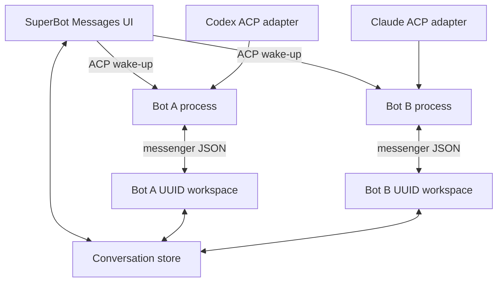

# SuperBot architecture

This document turns the supplied Excalidraw sketch into explicit product invariants and implementation boundaries.
The original references are preserved beside it as `superbot-architecture.png` and `superbot-architecture.excalidraw.json`.

## System flow

The number of processes follows the number of bots, not the number of conversations. Two bots participating in two group chats still produce two harness processes. Each process may own several ACP sessions, one per conversation.

## Harness discovery

Discovery has three distinct layers:

1. Desktop application presence, such as `ChatGPT.app` or `Claude.app`.
2. Command-line engine presence, such as the bundled Codex executable.
3. ACP adapter presence, such as `codex-acp` or `claude-agent-acp`.

Only the third state is launch-ready. This matters because the detected Codex CLI currently exposes its own app-server protocol rather than a native ACP endpoint. The installed Claude desktop app likewise does not expose a Claude CLI at the sketched resource path. SuperBot reports these facts instead of inferring compatibility from an app bundle name.

ACP uses JSON-RPC over a persistent subprocess transport. A normal turn initializes the connection, creates or restores a session, sends `session/prompt`, and receives `session/update` notifications. SuperBot's runtime owns a single subprocess dictionary keyed by bot UUID, while that process owns a conversation-to-session dictionary. See the [official ACP overview](https://agentclientprotocol.com/protocol/overview).

## Agent workspace and managed skills

Every bot directory is named with an opaque UUID. `AGENTS.md` contains provider-neutral guidance, while `CLAUDE.md` is a relative symlink to the same instructions. The managed Messenger skill consists of:

- `.agents/skills/messenger/SKILL.md`
- `.agents/skills/messenger/messenger`, a symlink to the running SuperBot executable
- `.agents/managed-skills.json`, recording the managed pack version and paths

On app updates, SuperBot refreshes only paths declared in that manifest. Skills created elsewhere under `.agents/skills` remain bot-owned and are not removed.

The executable determines the bot from the symlink's containing UUID workspace. `--get-latest` returns unread messages across all conversations containing that bot and advances per-conversation offsets in `.agents/inbox.json`. A bot never receives its own replies back as unread work.

## Message and attachment ownership

Conversation metadata, messages, attachment metadata, and copied payloads share one conversation directory. Messages link attachments by UUID; attachment filenames on disk use UUIDs rather than untrusted original names. The original filename and MIME type remain metadata for display and harness consumption.

Message array mutation is guarded by a per-conversation filesystem lock and written atomically, allowing the app and multiple bot processes to post safely into a group transcript. The open app refreshes transcripts so replies written by the Messenger command appear without relaunching.

## Runtime behavior

Sending a user message has two effects:

1. Persist the message and attachments to the conversation.
2. Wake every participating bot through its existing ACP process, creating the process only if that bot does not already have one.

The ACP prompt is a notification to inspect Messenger rather than a second copy of the user's message. This keeps the conversation store authoritative and gives every provider the same retrieval contract. A group chat fans the wake-up out to its participant bot UUIDs; it never creates a group-specific harness process.

## Security

SuperBot keeps App Sandbox enabled. Attachment import uses the native file importer and the `com.apple.security.files.user-selected.read-only` entitlement. Imported data is copied into the conversation before access ends.

No all-files, temporary-exception, Apple Events, device, personal-data, or incoming-network entitlement is present. The current bundle contains no third-party runtime library or helper. Before an ACP adapter is shipped or installed, its code-signing, sandbox inheritance, authentication storage, and outbound-network requirements must be verified as a separate boundary.
