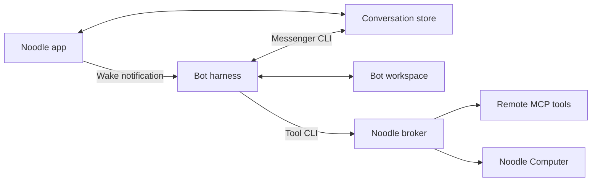

# Architecture

Noodle coordinates work with individual agents and groups. It stores conversations
locally and runs one harness process per bot, sharing that bot's session across
direct and group work.

## Message flow

1. The app saves a message and its attachments.
2. It notifies each bot in the conversation. The wake contains no message body.
3. Each bot reads its inbox through Messenger and replies through the same CLI.
4. Noodle observes the stored reply and updates the chat and notifications.

Messenger advances each bot's read positions and excludes its own messages.
Conversation writes use filesystem locks and atomic replacement so several bots
can reply safely. See [storage](storage-and-messenger.md) and the
[message reference](message-reference.md).

## Harnesses and recovery

Drivers share a `start`, `stop`, and `notify` interface:

| Harness | Transport |
| --- | --- |
| Codex | App Server |
| Claude Code | stream-json |
| FX, Grok Build | ACP |
| Muse Code | MSP |

Noodle starts configured bots when it opens and stops them when it quits. Closing
a window leaves them running. Notifications coalesce while a bot is busy.
Unexpected exits trigger bounded retries; terminal failures can require manual retry.

Session IDs and unfinished-work markers survive restarts. Recovery tells the bot
to check its inbox and continue interrupted work. External actions may already have
completed, so the bot must verify before repeating them. Heartbeats use the same
wake path for authorized follow-ups during idle time.

## Workspaces and access

Each bot has a UUID-named workspace. `AGENTS.md` holds its backstory and managed
runtime guidance; `CLAUDE.md` points to the same file. Noodle refreshes managed
skills while preserving custom skills and user-written backstories.

Restricted harnesses inherit the app sandbox. Autonomous harnesses run through
the signed Agent Host outside it. The app brokers remote tools and Computer
requests after checking assignments. See [agent access](security.md),
[MCP connections](mcp-connections.md), and the [Computer bridge](../Computer/Bridge/README.md).

[Documentation](README.md)
