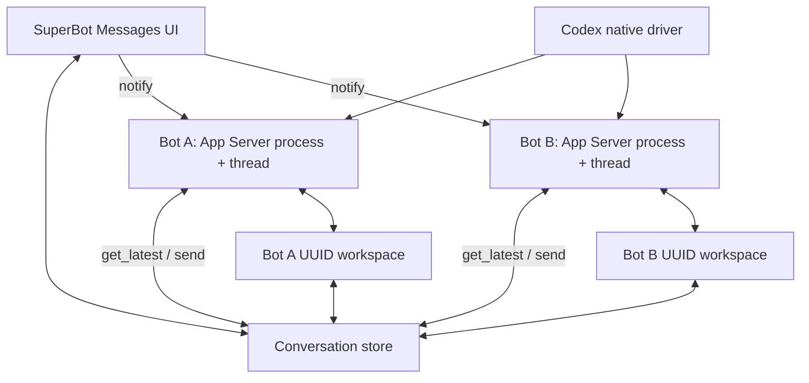

# SuperBot architecture

This document turns the supplied Excalidraw sketch into explicit product invariants and implementation boundaries.
The original references are preserved beside it as `superbot-architecture.png` and `superbot-architecture.excalidraw.json`.

## System flow

The number of processes follows the number of bots, not the number of conversations. Two bots participating in two group chats still produce two harness processes. Each Codex process owns one persistent thread and reads every direct or group conversation that includes its bot UUID.

## Harness discovery

SuperBot advertises only harnesses for which it has a complete native driver. The first driver looks for the executable bundled inside `ChatGPT.app` or `Codex.app`, followed by conventional local binary directories. Finding a desktop application without its executable does not make a harness selectable.

Capability enumeration is harness-specific and private. The Codex driver calls `model/list`, converts the result into provider-neutral model and effort records, and presents those choices when creating or editing a bot. No ACP adapter or readiness layer exists.

## Agent workspace and managed skills

Every bot directory is named with an opaque UUID. `AGENTS.md` contains provider-neutral guidance, while `CLAUDE.md` is a relative symlink to the same instructions. The managed Messenger skill consists of:

- `.agents/skills/messenger/SKILL.md`
- `.agents/skills/messenger/messenger`, a symlink to the running SuperBot executable
- `.agents/managed-skills.json`, recording the managed pack version and paths

On app updates, SuperBot refreshes only paths declared in that manifest. Skills created elsewhere under `.agents/skills` remain bot-owned and are not removed.

Codex receives two thread-scoped dynamic tools from SuperBot. `superbot_get_latest` returns unread messages across all conversations containing that bot and advances per-conversation offsets in `.agents/inbox.json`. `superbot_send` validates the conversation and writes the agent reply. A bot never receives its own replies back as unread work. The bundled command-line helper exposes the same repository operations for future harness drivers that prefer shell commands.

## Message and attachment ownership

Conversation metadata, messages, attachment metadata, and copied payloads share one conversation directory. Messages link attachments by UUID; attachment filenames on disk use UUIDs rather than untrusted original names. The original filename and MIME type remain metadata for display and harness consumption.

Message array mutation is guarded by a per-conversation filesystem lock and written atomically, allowing the app and multiple bot processes to post safely into a group transcript. The open app refreshes transcripts so replies written by the Messenger command appear without relaunching.

## Runtime behavior

Sending a user message has two effects:

1. Persist the message and attachments to the conversation.
2. Call `notify` on every participating bot through its existing process, creating the process only if that bot does not already have one.

The Codex driver translates `notify` into an inbox-changed event with no message body. Codex must call `superbot_get_latest`, decide what to do, and publish replies with `superbot_send`. This keeps the conversation store authoritative and gives every provider the same retrieval contract. A group chat fans the notification out to participant bot UUIDs; it never creates a group-specific harness process. Notifications coalesce while a bot is already working.

At application startup, SuperBot starts every configured bot and resumes its stored Codex thread. At application termination, it stops every child process. Creating or editing a bot starts or restarts only that bot.

## Security

SuperBot keeps App Sandbox enabled. Attachment import uses the native file importer and the `com.apple.security.files.user-selected.read-only` entitlement. Imported data is copied into the conversation before access ends. Codex requires outgoing client networking and a temporary home-relative read/write exception limited to `/.codex/`; the driver explicitly sets `CODEX_HOME` to that directory so the sandbox does not redirect Codex to an unauthenticated container-local home.

There is no broad home-directory, Apple Events, device, personal-data, or incoming-network entitlement. The minimal bundled Messenger helper is signed separately without application entitlements and operates only within the bot workspace and conversation roots supplied by the runtime.
