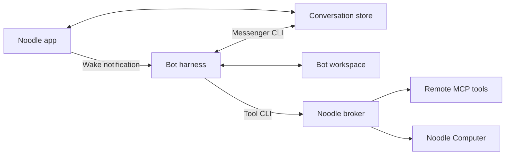

# Architecture

Noodle coordinates work with individual agents and groups. It stores conversations
locally and runs one harness process per bot, sharing that bot's session across
direct and group work.

## Message flow

1. The app saves a message and its attachments.
2. It notifies each bot in the conversation. The wake contains no message body.
3. Each bot reads its inbox through Messenger and replies through the same CLI.
4. Noodle observes the stored reply and updates the chat and notifications.

Messenger advances each bot's read positions and excludes its own messages.
Conversation writes use filesystem locks and atomic replacement so several bots
can reply safely. See [storage](storage-and-messenger.md) and the
[message reference](message-reference.md).

## Harnesses and recovery

Drivers share a `start`, `stop`, and `notify` interface:

| Harness | Transport |
| --- | --- |
| Codex | App Server |
| Claude Code | stream-json |
| FX, Grok Build | ACP |
| Muse Code | MSP |
| Apple Intelligence | ACP through the bundled `NoodleAppleAgent` helper |

Noodle starts configured bots when it opens and stops them when it quits. Closing
a window leaves them running. Notifications coalesce while a bot is busy.
Unexpected exits trigger bounded retries; terminal failures can require manual retry.

Session IDs and unfinished-work markers survive restarts. Recovery tells the bot
to check its inbox and continue interrupted work. External actions may already have
completed, so the bot must verify before repeating them. Heartbeats use the same
wake path for authorized follow-ups during idle time.

## Workspaces and access

Each bot has a UUID-named package containing `agent.json`, Noodle-owned `runtime`
state, and a writable `workspace` subdirectory. The private `backstory` field in
`agent.json` is the source of truth; it is omitted from the public `AgentRecord`
used by profiles and participant lists. Edit Backstory through Noodle. `AGENTS.md`
renders that backstory and runtime guidance; `CLAUDE.md` points to the same file.
The whole file is generated, without managed-section markers. Noodle can replace
edited, missing, or corrupted output without parsing it or changing Backstory.
Custom skills are preserved. Keep standing preferences in `preferences.md` and durable facts,
decisions, and ongoing context in `memory.md`. Noodle creates `preferences.md` when
missing, including in existing workspaces, and never overwrites its contents.
Agents are instructed to read it at session start and after changes; newer explicit
user requests take precedence. Apple loads a bounded preference excerpt alongside
the backstory for every wake, including chat turns without workspace tools.

At app startup, the one-time `AgentBackstoryMigration` runs after the directory
migration and before bots load. It imports legacy marked Backstory, custom
`AGENTS.md`, or older `instructions.md` into `agent.json` atomically before any
regeneration. A present string, including an empty one, marks completion. Missing
or damaged legacy sources stop migration with their files intact. The parser is
isolated for retirement after the 0.14.0 update milestone; the configuration check
must remain. Backstory migration does not grant legacy unrestricted access.

The signed Agent Host applies a dedicated filesystem sandbox before starting
restricted Codex, FX, Grok Build, Muse Code, or Apple. Each can read only its own
bot package alongside required system/application files, and write its workspace;
parent configuration and runtime state stay read-only. Cloud harness homes and
session stores are private to the bot, seeded only with provider login material.
Messenger uses an app-side broker bound to the registered bot workspace and token.
The broker checks conversation membership and copies attachments into the caller's
workspace, keeping raw conversation files and other bots' packages inaccessible.
Unrestricted harnesses use a separate authorized launch path. The app remains in
App Sandbox and brokers remote tools and Computer
requests after checking assignments. See [agent access](security.md),
[MCP connections](mcp-connections.md), and the [Computer bridge](../Computer/Bridge/README.md).

## Built-in Apple Intelligence harness

`NoodleAppleAgent` is a signed private executable bundled in `Contents/Helpers`.
Agent Host validates its exact bundle path and signing identity. It reports its
own model catalogue and availability through `--inspect`; initially this is the
Default Apple Intelligence on-device model. Harness lists put Codex first and
Apple last. New bots select the first available harness, including Apple when
it is the only option. Settings, the chooser, and bot creation identify Apple
as experimental and warn that responses may be slow or unreliable. Existing
bots retain their selected harness.

The helper uses the same ACP lifecycle as other harnesses, including interrupted
turn recovery, session cancellation, heartbeats, and changing access by stopping
the old runtime first. Every turn exposes exactly `bash`, `read`, and `write`.
Bash runs the same workspace CLIs used by other harnesses: Messenger, assigned
MCP connections, Computer, and Applet, with their existing broker permissions.
Workspace `AGENTS.md` and the relevant skills describe these interfaces. There
is no request classification or dedicated conversation-history model tool.

The helper loads the inbox once and automatically delivers ordinary chat answers
to their original conversation. Background events use explicit Messenger CLI
sends. All conversation turns resume their saved Foundation Models transcript,
including text chat and images, with current instructions and tools. Visible chat
history is never converted into synthetic model response entries: it may include
other harnesses, grouped deliveries, or broken earlier replies. A first session
receives a bounded excerpt of recent user messages as quoted context. Older
messages remain available through the shared Messenger CLI.

On macOS 27, the native profile uses Apple's Foundation Models Utilities to
summarize history beyond eight entries and remove completed tool exchanges from
generation input. Successful summaries become part of the saved native session;
the newest request is excluded from summary input. Failed generations preserve
their transcript, and completed commands in interrupted turns remain available
on resume until a final response or summary records their results.
Summaries preserve completed actions; the current request remains verbatim.
Summarization uses the selected model without tools, with a 256-token response limit. If its input is
too large, the fallback retains recent whole turns, so saved history stays bounded.
Every tool exchange for the current prompt stays available. The executor's token
budget trims whole older turns before each generation, including tool continuations.
It also bounds large tool results and images and reserves room for the response.
When the current tool sequence fills the budget, the next generation finishes
from the existing results with further tool calls disabled. This uses the same
session and never replays completed commands.
The macOS 26 fallback retains up to eight complete turns within a 6,000-byte budget
shared with the current prompt, keeping each turn's calls and results together.
The utilities' [source version, licence, and compatibility adaptations](../Support/ThirdParty/FoundationModelsUtilities/README.md)
are recorded in the repository. Older chat remains available
through the Messenger CLI. Every turn can execute actions, so a context or tool
failure propagates without a fresh tool-free retry that could repeat work.
Pending replies survive restarts; completed model results are saved before delivery
and reused on retry, avoiding repeat tool execution after interrupted delivery.
The limited on-device context is intended for small tasks. Long tool results
are stored in `.noodle/apple/outputs` and read in pages; context failures leave
unfinished work recoverable. Commands stop after 60 seconds or 1 MiB of output,
and cancellation stops command descendants. A turn is limited to 32 tool calls
and five minutes. The last model transcript and an unfinished-turn marker stay
in `.noodle/apple` for local diagnostics and recovery, including after cancellation.
Native session caches are in `.noodle/apple/conversations/<conversation-id>.json`.
Background events resume `.noodle/apple/events.json` with the same context
management. Interrupted transcripts are saved without a completed reply receipt;
unreadable session files report an error instead of silently resetting context.

Opt-in live regressions (`NOODLE_TEST_APPLE_MODEL=1`) exercise synthetic conversations
and files through the helper sandbox. They cover recall across wakes, recovery from
old greeting loops and false answers, updates to remembered facts, and delivery of
completed results without rerunning commands. Set `NOODLE_APPLE_TEST_HELPER` to a
bundled helper path to exercise the signed application artifact.

Model availability and a completed turn do not establish answer quality. The
live recall regressions can still echo corrections, dump retrieved history instead
of answering, or produce a false refusal even with the original user messages in
the prompt. Keep those live assertions: context containment does not make this
model a reliable default agent.

Restricted Apple runs under its own deny-by-default Seatbelt policy: system and
own-bot package reads, workspace writes, and the required
Apple model services. It does not receive Codex credentials or outbound network
access. Unrestricted mode uses the existing explicit per-bot authorization.
Additional models and tools can be added behind the helper protocol without
hardcoding a model list in Noodle's UI.

[Documentation](README.md)
