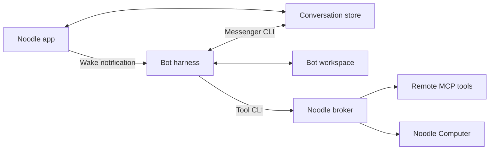

# Architecture

Noodle coordinates work with individual agents and groups. It stores conversations
locally and runs one harness process per bot, sharing that bot's session across
direct and group work.

## Message flow

1. The app saves a message and its attachments.
2. It notifies each bot in the conversation. The wake contains no message body.
3. Each bot reads its inbox through Messenger and replies through the same CLI.
4. Noodle observes the stored reply and updates the chat and notifications.

Messenger advances each bot's read positions and excludes its own messages.
Conversation writes use filesystem locks and atomic replacement so several bots
can reply safely. See [storage](storage-and-messenger.md) and the
[message reference](message-reference.md).

## Harnesses and recovery

Drivers share a `start`, `stop`, and `notify` interface:

| Harness | Transport |
| --- | --- |
| Codex | App Server |
| Claude Code | stream-json |
| FX, Grok Build | ACP |
| Muse Code | MSP |

Noodle starts configured bots when it opens and stops them when it quits. Closing
a window leaves them running. Notifications coalesce while a bot is busy.
Unexpected exits trigger bounded retries; terminal failures can require manual retry.

Session IDs and unfinished-work markers survive restarts. Recovery tells the bot
to check its inbox and continue interrupted work. External actions may already have
completed, so the bot must verify before repeating them. Heartbeats use the same
wake path for authorized follow-ups during idle time.

## Workspaces and access

Each bot has a UUID-named package containing `agent.json`, Noodle-owned `runtime`
state, and a writable `workspace` subdirectory. `AGENTS.md` holds its backstory and managed
runtime guidance; `CLAUDE.md` points to the same file. Noodle refreshes managed
skills while preserving custom skills and user-written backstories.

The signed Agent Host applies a dedicated filesystem sandbox before starting
restricted Codex, FX, Grok Build, Muse Code, or Apple, protecting its parent configuration and runtime state.
Autonomous harnesses use a separate authorized launch path. The app remains in
App Sandbox and brokers remote tools and Computer
requests after checking assignments. See [agent access](security.md),
[MCP connections](mcp-connections.md), and the [Computer bridge](../Computer/Bridge/README.md).

## Built-in Apple harness

`NoodleAppleAgent` is a signed private executable bundled in `Contents/Helpers`.
Agent Host validates its exact bundle path and signing identity. It reports its
own model catalogue and availability through `--inspect`; initially this is the
Default Apple Intelligence on-device model. Harness lists put Codex first and
Apple last. New bots select the first available harness, including Apple when
it is the only option. Settings, the chooser, and bot creation identify Apple
as experimental and warn that responses may be slow or unreliable. Existing
bots retain their selected harness.

The helper uses the same ACP lifecycle as other harnesses, including interrupted
turn recovery, session cancellation, heartbeats, and changing access by stopping
the old runtime first. It supports `read_file`, `write_file`, `execute_command`,
and bot-bound Messenger operations. The helper loads the inbox once. Chat turns
start fresh and retrieve original conversation messages through the history tool,
preventing an earlier mistaken answer or refusal from conditioning every later reply.
Workspace turns resume the actual Foundation Models transcript saved for that conversation.
Visible chat history is never converted into synthetic model response entries:
it may include other harnesses, grouped deliveries, or broken earlier replies.
The harness delivers ordinary chat answers to their original conversation
automatically. Background events use explicit Messenger sends.
File and command tools require a concrete workspace reference in the current or
recent user requests, followed by local category classification. Assistant text
cannot supply that reference. History retrieval remains available in every session;
recall requests use the original messages rather than relying on model paraphrases.
Both modes retain the bot's existing access policy.
Restored native history includes up to eight complete turns within a 6,000-byte
budget shared with the current prompt, retaining each turn's tool calls and
results together. Older chat remains available
as compact speaker-and-message text through the conversation history tool, which
can exclude assistant replies when retrieving user-provided facts.
Chat prompts include up to 2,048 bytes of recent user messages as quoted reference,
so ordinary follow-ups do not require a separate history tool call.
History retrieval also has a per-turn budget (four unique pages and 6,400 bytes)
and rejects duplicate page requests. If chat exhausts retrieval or model context,
one fresh session without tools answers from bounded retrieved source text.
The recovery prompt uses system token counts where available, reserving space
for the answer. File and command turns are never automatically replayed this way.
Pending replies survive restarts; completed model results are saved before delivery
and reused on retry, avoiding repeat tool execution after interrupted delivery.
The limited on-device context is intended for small tasks. Long tool results
are stored in `.noodle/apple/outputs` and read in pages; context failures leave
unfinished work recoverable. Commands stop after 60 seconds or 1 MiB of output,
and cancellation stops command descendants. A turn is limited to 32 tool calls
and five minutes. The last model transcript and an unfinished-turn marker stay
in `.noodle/apple` for local diagnostics and recovery, including after cancellation.
Native session caches are in `.noodle/apple/conversations/<conversation-id>.json`.

Opt-in live regressions (`NOODLE_TEST_APPLE_MODEL=1`) exercise synthetic conversations
and files through the helper sandbox. They cover recall across wakes, recovery from
old greeting loops and false answers, updates to remembered facts, and delivery of
completed results without rerunning commands. Set `NOODLE_APPLE_TEST_HELPER` to a
bundled helper path to exercise the signed application artifact.

Model availability and a completed turn do not establish answer quality. The
live recall regressions can still echo corrections, dump retrieved history instead
of answering, or produce a false refusal even with the original user messages in
the prompt. Keep those live assertions: context containment does not make this
model a reliable default agent.

Restricted Apple runs under its own deny-by-default Seatbelt policy: system and
Noodle repository reads, workspace and conversation writes, and the required
Apple model services. It does not receive Codex credentials or outbound network
access. Autonomous mode uses the existing explicit per-bot authorization.
Additional models and tools can be added behind the helper protocol without
hardcoding a model list in Noodle's UI.

[Documentation](README.md)
